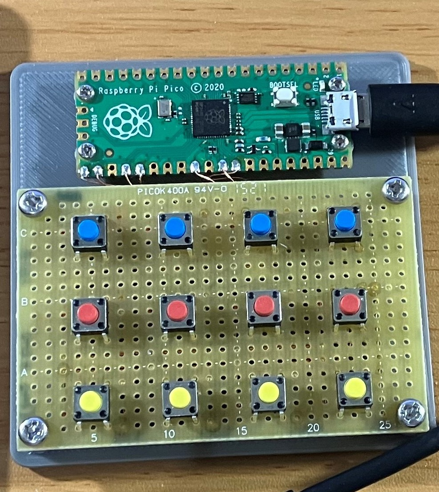

# pico_keymatrix_usb
raspberry pi picoを使った自作キーマトリックスUSBデバイス

# Features
- 4x3 の自作キーマトリックスを USBキーボートとして認識させ、各キーに自由にキーマッピングや複数のキーコードの送出ができます。

# Install
1. Circuit Python v7 の UF2 イメージをダウンロードする。(adafruit-circuitpython-raspberry_pi_pico-ja-7.3.3.uf2)
[Circuit Python]: (https://circuitpython.org/board/raspberry_pi_pico/)
1. BOOTSEL ボタンを押しながら pico をUSBでPCに接続し、接続されたストレージにUF2ファイルをコピーする。
1. ストレージにできた lib フォルダに pico_keymatrix_usb/lib/adafruit_hid フォルダをコピーする。
1. ストレージの直下に boot.py code.py をコピーする。

# How to

## 動作の変更方法
1. GP

# 回路図

