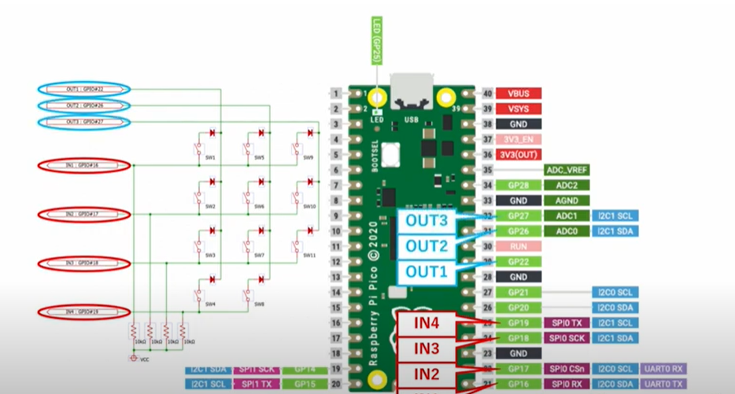

# pico_keymatrix_usb
raspberry pi picoを使った自作キーマトリックスUSBデバイス

# Features
* 4x3 の自作キーマトリックスを USBキーボートとして認識させ、各キーに自由にキーマッピングや複数のキーコードの送出ができる。
* キースキャンは、0.05秒ごとに行うようシミュレーションしている。(割り込み処理は行っていない。) キーマトリックスの回路とキースキャンの実装により、複数のキーを押したタイミング、キーを話したタイミングを知ることができる。

# Usage
## How to Install
1. Circuit Python v7 の UF2 イメージをダウンロードする。(adafruit-circuitpython-raspberry_pi_pico-ja-7.3.3.uf2)  
[Circuit Python (Raspberry Pi Pico)](https://circuitpython.org/board/raspberry_pi_pico/)
1. BOOTSEL ボタンを押しながら pico をUSBでPCに接続し、接続されたストレージにUF2ファイルをコピーする。
1. ストレージにできた lib フォルダに pico_keymatrix_usb/lib/adafruit_hid フォルダをコピーする。
1. ストレージの直下に boot.py code.py をコピーする。

## How to mount storage on pico
1. GP16に接続されているキー(0x00)を押しながら、USBにpicoを接続すると、ストレージとシリアルポートが見えるようになる。

## How to Uninstall
どうしてもストレージのマウントができなくなった場合は、picoのフラッシュをクリアする必要がある。
1. Raspberry Pi の公式URLから の flash_nuke.uf2 をダウンロードする。  
[flash_nuke.uf2](https://www.raspberrypi.com/documentation/microcontrollers/raspberry-pi-pico.html#resetting-flash-memory)
1. BOOTSEL ボタンを押しながら pico をUSBでPCに接続し、接続されたストレージにUF2ファイルをコピーする。

## How to modified keymap
各キーは、0番～11番の番号が割り振られている。
code.py 内の sendKeycode() 関数内にて、各キーが押されたとき(KeyTurnOn)のキーコードの送出を定義できる。 キーが離されたとき(KeyTurnOff)などもトリガーにできる。
キーコードの送出は、lib/adafruit_hid/keycode.mpy などを参照するとよい。

# Circuit

# Reference
* [Circuit Python (Raspberry Pi Pico)](https://circuitpython.org/board/raspberry_pi_pico/)
* [CircuitPython HID Keyboard and Mouse](https://learn.adafruit.com/circuitpython-essentials/circuitpython-hid-keyboard-and-mouse)
* [Adafruit_CircuitPython_HID (github)](https://github.com/adafruit/Adafruit_CircuitPython_HID)

# License
MIT LICENSE

# Author
* [rimksky][]

[rimksky]: https://github.com/rimksky "rimksky"
