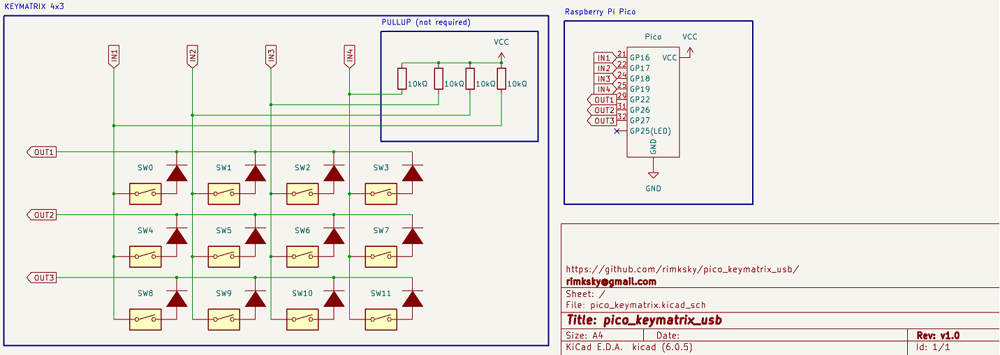

# pico_keymatrix_usb
Homebrew key matrix usb device with raspberry pi pico.

# Features
* The 4x3 key matrix can be recognized as a USB keyboard, and each key can be freely mapped and multiple key codes can be sent.
* Key scan is simulated to be performed every 0.05 seconds. No interrupt processing is performed. By implementing a key matrix circuit and software key scan, it is possible to know when multiple keys are pressed and when a key is released.

# Usage
## How to Install
1. Download the UF2 image for CircuitPython v7. (adafruit-circuitpython-raspberry_pi_pico-ja-7.3.3.uf2)  
[CircuitPython (Raspberry Pi Pico)](https://circuitpython.org/board/raspberry_pi_pico/)
1. While pressing the BOOTSEL button, connect pico to your PC via USB and copy the UF2 file to the connected storage.
1. Copy the pico_keymatrix_usb/lib/adafruit_hid folder to the lib folder mounted as the storage.
1. Copy pico_keymatrix_usb/boot.py pico_keymatrix_usb/code.py files directly under storage.

## How to Mount Storage of Pico
1. If you connect pico to USB while pressing the key (0x00) connected to GP16, you can see the storage and serial port by CircuitPython.

## How to Uninstall
If you cannot mount the storage by any means, you need to clear the flash of pico.
1. Download flash_nuke.uf2 from the official Raspberry Pi URL.  
[flash_nuke.uf2](https://www.raspberrypi.com/documentation/microcontrollers/raspberry-pi-pico.html#resetting-flash-memory)
1. While pressing the BOOTSEL button, connect pico to your PC via USB and copy the UF2 file to the connected storage.

## How to Modify Key Mapping
Each key is assigned a number from 0 to 11.  
In the sendKeycode() function in code.py, you can define sending keycodes when each key is pressed (KeyTurnOn). It can also be triggered when a key is released (KeyTurnOff).  
Refer to lib/adafruit_hid/keycode.mpy for sending keycode.

# Circuit

# Reference
* [CircuitPython (Raspberry Pi Pico)](https://circuitpython.org/board/raspberry_pi_pico/)
* [CircuitPython HID Keyboard and Mouse](https://learn.adafruit.com/circuitpython-essentials/circuitpython-hid-keyboard-and-mouse)
* [github: Adafruit_CircuitPython 7.3.3](https://github.com/adafruit/circuitpython/releases/tag/7.3.3)
* [github: Adafruit_CircuitPython_HID](https://github.com/adafruit/Adafruit_CircuitPython_HID)

# License
MIT LICENSE

# Author
* [rimksky][]

[rimksky]: https://github.com/rimksky "rimksky"
